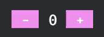

# haalka [হালকা](https://translate.google.com/?sl=bn&tl=en&text=%E0%A6%B9%E0%A6%BE%E0%A6%B2%E0%A6%95%E0%A6%BE&op=translate)
```
in bengali, haalka means "light" (e.g. not heavy) and can also be used to mean "easy"
```

`haalka` is an ergonomic reactive bevy ui library, a lightweight, macroless alternative to the [proposed DSL](https://github.com/bevyengine/bevy/discussions/9538) with the reactivity question answered !

powered by the incredible FRP signals of https://github.com/Pauan/rust-signals and the super convenient async ecs of https://github.com/dlom/bevy-async-ecs with API ported from https://github.com/Pauan/rust-dominator and https://github.com/MoonZoon/MoonZoon

## examples

<p align="center">
  
</p>

write bevy ui's with the signal semantics you're used to from [MoonZoon](https://github.com/MoonZoon/MoonZoon) and [Dominator](https://github.com/Pauan/rust-dominator) !
```rust
use bevy::prelude::*;
use haalka::*;
use futures_signals::signal::{Mutable, SignalExt};
use futures_signals_ext::*;

fn main() {
    App::new()
    .add_plugins((DefaultPlugins, HaalkaPlugin))
    .add_systems(Startup, (ui_root, camera))
    .run();
}

#[derive(Component)]
struct Counter(Mutable<i32>);

fn ui_root(world: &mut World) {
    let counter = Mutable::new(0);
    El::<NodeBundle>::new()
    .with_style(|style| {
        style.width = Val::Percent(100.);
        style.height = Val::Percent(100.);
    })
    .align_content(Align::center())
    .child(
        Row::<NodeBundle>::new()
        .with_style(|style| style.column_gap = Val::Px(15.0))
        .item(counter_button(counter.clone(), "-", -1))
        .item(
            El::<TextBundle>::new()
            .text_signal(
                counter.signal()
                .map(|count| {
                    Text::from_section(
                        count.to_string(),
                        TextStyle { font_size: 30.0, ..default() },
                    )
                })
            )
        )
        .item(counter_button(counter.clone(), "+", 1))
        .update_raw_el(move |raw_el| raw_el.insert(Counter(counter)))
    )
    .spawn(world);
}

fn counter_button(counter: Mutable<i32>, label: &str, step: i32) -> impl Element {
    let hovered = Mutable::new(false);
    let pressed = Mutable::new(false);
    El::<ButtonBundle>::new()
    .with_style(|style| style.width = Val::Px(45.0))
    .align_content(Align::center())
    .background_color_signal(
        signal::or(hovered.signal(), pressed.signal()).dedupe()
        .map_bool(
            || Color::hsl(300., 0.75, 0.85),
            || Color::hsl(300., 0.75, 0.75),
        )
        .map(BackgroundColor)
    )
    .on_hovered_change(move |is_hovered| hovered.set_neq(is_hovered))
    .on_pressed_change(move |is_pressed| {
        if is_pressed { *counter.lock_mut() += step }
        pressed.set_neq(is_pressed);
    })
    .child(
        El::<TextBundle>::new()
        .text(Text::from_section(label, TextStyle { font_size: 30.0, ..default() }))
    )
}

fn camera(mut commands: Commands) {
    commands.spawn(Camera2dBundle::default());
}
```

run the examples with [`just`](https://github.com/casey/just) (`cargo install just`)
```bash
just example counter  # the example above
just example button  # port of https://github.com/bevyengine/bevy/blob/main/examples/ui/button.rs
# in progress ui challenges from https://github.com/bevyengine/bevy/discussions/11100
just example challenge01  # in progress
```
